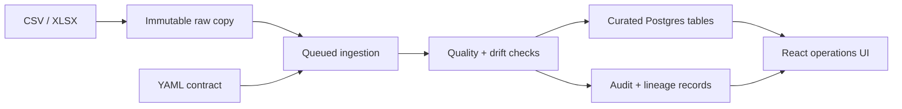

# EventPulse Data Platform

**Turn recurring files into data products you can trace.**

[](https://github.com/ryne2010/eventpulse-data-platform/actions/workflows/ci.yml)

EventPulse is a local-first ingestion platform for data and platform engineers. It accepts CSV and XLSX deliveries, preserves a content-addressed raw copy, evaluates each file against a versioned YAML contract, and publishes curated Postgres tables with quality, drift, and lineage records attached.

The repository is deliberately narrow: it shows the controls around a trustworthy ingestion path, not a catalog of connectors or a finished multi-tenant product.

## Why it exists

Recurring files look simple until a producer renames a column, resends yesterday's extract, or a worker dies halfway through a load. EventPulse makes those cases explicit.

| Failure mode | Control |
| --- | --- |
| A file is delivered twice | Content-addressed raw storage plus primary-key upserts keep curated facts idempotent |
| Data arrives malformed or changed | YAML contracts, quality rules, stable schema hashes, and `warn` / `fail` / `allow` drift policies |
| A worker is interrupted | Atomic job claims, bounded attempts, heartbeats, and stale-job reclamation |
| An operator cannot explain a row | Raw, contract, and schema hashes plus ingestion, audit, and lineage records |

## How it works



The local runtime uses FastAPI, Postgres, Redis, and RQ. The React UI exposes ingestion status, contract results, schema history, curated samples, data products, trends, and audit events. Replays create a new ingestion record for the audit trail; contract primary keys prevent duplicate curated rows.

## Run it locally

You need Docker with Compose and `make`.

```bash
make smoke
```

The smoke path builds and starts the API, worker, Postgres, and Redis; seeds synthetic parcel data; verifies API and SPA routes; and waits for the curated marts. Open [http://localhost:8081](http://localhost:8081) to inspect the result.

```bash
make down
```

For hot reload, file-watcher ingestion, and manual API examples, use the [local development guide](docs/LOCAL_DEV.md). Note that `make dev` begins with a local data reset.

## What is implemented

- CSV and XLSX ingestion by upload, watched directory, or GCS object reference
- Filesystem or GCS raw storage with SHA-256 addressing
- Contract parsing, quality checks, deterministic schema drift, and policy enforcement
- Redis/RQ jobs locally or Cloud Tasks callbacks on Cloud Run
- Curated Postgres tables, marts, replay, audit events, and per-ingestion lineage
- A React operations UI and protected administrative endpoints

The GCP lane is an optional deployment reference: Terraform provisions the Cloud Run path, GCS storage, Cloud Tasks, IAM, and supporting services. It requires a GCP project, secrets, and an external Postgres database; this repository does not claim a live public deployment. The BigQuery loader is a placeholder, and the intentionally simple identity model is not a multi-tenant authorization system.

## Validate a change

Install the locked Python and Node dependencies, then run:

```bash
make lint
make typecheck
make test
make web-check
```

CI runs the lint, type-check, and test gates on every pull request and push to `main`.

## Read next

- [Architecture](ARCHITECTURE.md) — components, data flow, and boundaries
- [Quick tour](docs/QUICK_TOUR.md) — guided inspection of the working system
- [Contracts](docs/CONTRACTS.md) — public interfaces and invariants
- [Schema drift](docs/SCHEMA_DRIFT.md) — comparison and policy behavior
- [GCP deployment](docs/DEPLOY_GCP.md) — prerequisites, Terraform, and verification
- [Runbook](RUNBOOK.md) — routine operations and recovery paths

MIT licensed. See [LICENSE](LICENSE).
